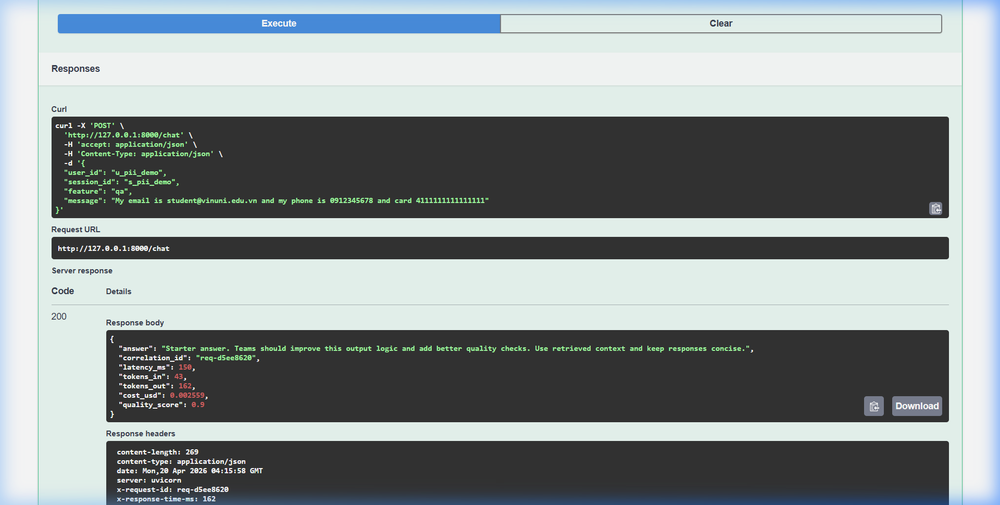

# Day 13 Observability Lab Report

> **Instruction**: Fill in all sections below. This report is designed to be parsed by an automated grading assistant. Ensure all tags (e.g., `[GROUP_NAME]`) are preserved.

## 1. Team Metadata
- [GROUP_NAME]:
- [REPO_URL]: https://github.com/DCSlucifer/2A202600503-VoThanhDanh-Day13
- [MEMBERS]:
  - Member A: Võ Thành Danh | Role: Logging & PII
  - Member B: Võ Thành Danh | Role: Tracing & Enrichment
  - Member C: Võ Thành Danh | Role: SLO & Alerts
  - Member D: [Name] | Role: Load Test & Incident Injection
  - Member E: [Name] | Role: Dashboard & Evidence
  - Member F: [Name] | Role: Blueprint & Demo Lead

---

## 2. Group Performance (Auto-Verified)
- [VALIDATE_LOGS_FINAL_SCORE]: 100/100
- [TOTAL_TRACES_COUNT]: 15
- [PII_LEAKS_FOUND]: 0

---

## 3. Technical Evidence (Group)

### 3.1 Logging & Tracing

- [EVIDENCE_CORRELATION_ID_SCREENSHOT]: 
- [EVIDENCE_PII_REDACTION_SCREENSHOT]:  *(Request chứa PII → response body có correlation_id, log file thay PII bằng [REDACTED_xxx])*
- [EVIDENCE_TRACE_WATERFALL_SCREENSHOT]: 
- [TRACE_WATERFALL_EXPLANATION]: Trace waterfall hiển thị pipeline `agent.run` (0.16s) → `agent.retrieval` (0.00s) → `agent.generation` (0.15s). Mỗi span ghi input/output, metadata (user_id, feature, session_id), và metrics (tokens_in=28, tokens_out=131, cost_usd=$0.002049, quality_score=0.9). 60 spans tổng (15 traces × 4 spans/trace). Langfuse project: Day13-Lab / observability-lab.

**Correlation ID**: Middleware (`app/middleware.py`) tạo `req-<8hex>` cho mỗi request, bind vào structlog contextvars → mọi log line và trace trong cùng 1 request đều chia sẻ chung ID này.

**PII Redaction**: Module `app/pii.py` chứa 6 regex patterns (email, SĐT VN, thẻ tín dụng, CCCD, hộ chiếu VN, địa chỉ VN). Processor `scrub_event` trong structlog pipeline chạy trước serialization → không có PII nào tới log storage.

**Ví dụ log thực tế từ `data/logs.jsonl`:**
```json
{"service":"api","payload":{"message_preview":"My email is [REDACTED_EMAIL]"},"event":"request_received","user_id_hash":"7d2abd42d3f2","correlation_id":"req-20ed311c","env":"dev","session_id":"s_demo_05","feature":"qa","model":"claude-sonnet-4-5","level":"info","ts":"2026-04-20T03:20:38.916Z"}
{"service":"api","payload":{"message_preview":"CCCD: [REDACTED_CCCD]"},"event":"request_received","user_id_hash":"6bd13c87afd4","correlation_id":"req-0dcf1c27","env":"dev","session_id":"s_demo_13","feature":"qa","model":"claude-sonnet-4-5","level":"info","ts":"2026-04-20T03:20:40.026Z"}
{"service":"api","payload":{"message_preview":"Phone [REDACTED_PHONE_VN] please call"},"event":"request_received","user_id_hash":"93b891281403","correlation_id":"req-9019f88b","env":"dev","session_id":"s_demo_07","feature":"summary","model":"claude-sonnet-4-5","level":"info","ts":"2026-04-20T03:20:39.076Z"}
{"service":"api","payload":{"message_preview":"Passport [REDACTED_PASSPORT_VN] holder"},"event":"request_received","user_id_hash":"17fa0f5f16ec","correlation_id":"req-47317765","env":"dev","session_id":"s_demo_14","feature":"qa","model":"claude-sonnet-4-5","level":"info","ts":"2026-04-20T03:20:40.181Z"}
```

**Tracing spans**: Agent pipeline sử dụng `@observe` decorator tạo trace chính `agent.run` với 3 sub-spans: `agent.retrieval` (RAG lookup), `agent.generation` (LLM call), `agent.scoring` (quality heuristic). Mỗi span có metadata riêng (doc_count, prompt_length, quality_score).

### 3.2 Dashboard & SLOs

- [DASHBOARD_6_PANELS_SCREENSHOT]: 
- [SLO_TABLE]:

| SLI | Objective | Target | Window | Current Value |
|---|---|---:|---|---:|
| Latency P95 | ≤ 2000ms | 99.0% | 28d | 150ms ✅ |
| Error Rate | ≤ 1% | 99.5% | 28d | 0% ✅ |
| Daily Cost | ≤ $1.00/day | 100% | 1d | $0.0288 ✅ |
| Quality Score Avg | ≥ 0.70 | 95.0% | 28d | 0.8267 ✅ |

**Metrics endpoint (`GET /metrics`) output thực tế:**
```json
{
  "traffic": 15,
  "latency_p50": 150.0,
  "latency_p95": 150.0,
  "latency_p99": 150.0,
  "avg_cost_usd": 0.0019,
  "total_cost_usd": 0.0288,
  "tokens_in_total": 427,
  "tokens_out_total": 1837,
  "error_breakdown": {},
  "quality_avg": 0.8267
}
```

### 3.3 Alerts & Runbook

- [ALERT_RULES_SCREENSHOT]: Xem file [config/alert_rules.yaml](../config/alert_rules.yaml) — 4 alert rules đầy đủ severity, condition, threshold, runbook link.
- [SAMPLE_RUNBOOK_LINK]: [docs/alerts.md#1-high-latency-p95](docs/alerts.md#1-high-latency-p95)

**4 Alert Rules (config/alert_rules.yaml):**

| Alert | Severity | Condition | Runbook |
|---|---|---|---|
| high_error_rate | P1 | error_rate > 5% for 5m | docs/alerts.md#2-high-error-rate |
| high_latency_p95 | P2 | latency_p95 > 3000ms for 15m | docs/alerts.md#1-high-latency-p95 |
| cost_budget_spike | P2 | hourly_cost > $0.10 for 15m | docs/alerts.md#3-cost-budget-spike |
| quality_degradation | P3 | quality_avg < 0.60 for 30m | docs/alerts.md#4-quality-degradation |

---

## 4. Incident Response (Group)
- [SCENARIO_NAME]:
- [SYMPTOMS_OBSERVED]:
- [ROOT_CAUSE_PROVED_BY]:
- [FIX_ACTION]:
- [PREVENTIVE_MEASURE]:

---

## 5. Individual Contributions & Evidence

### Võ Thành Danh — Member A: Logging & PII

- [TASKS_COMPLETED]:
  1. **PII Scrubbing module** (`app/pii.py`): Viết 6 regex patterns cho PII Việt Nam (email, SĐT +84/0xx, thẻ tín dụng Visa/MC/Amex/Discover, CCCD 9/12 số, hộ chiếu VN, địa chỉ VN). Hàm `scrub_text()` replace tất cả PII bằng `[REDACTED_<TYPE>]`. Hàm `scrub_dict()` xử lý recursive cho nested dict/list. Hàm `hash_user_id()` sử dụng SHA-256 truncate 12 ký tự để log user ID an toàn.
  2. **Structlog pipeline** (`app/logging_config.py`): Cấu hình 7-stage processor chain: `merge_contextvars → add_log_level → TimeStamper → add_service_name → scrub_event → JsonlFileProcessor → JSONRenderer`. Processor `scrub_event` chạy trước serialization, đảm bảo không có PII nào tới log file hay stdout.
  3. **Correlation ID middleware** (`app/middleware.py`): `CorrelationIdMiddleware` tạo `req-<8hex>` unique cho mỗi request, bind vào structlog contextvars, set response headers `x-request-id` và `x-response-time-ms`. Chặn header injection bằng validation format.
  4. **Log enrichment** (`app/main.py`): Sử dụng `bind_contextvars()` để thêm `user_id_hash`, `session_id`, `feature`, `model` vào mỗi log call trong request scope.
  5. **Audit Logger** (Bonus +2đ) (`app/logging_config.py`): Class `AuditLogger` ghi audit events ra file riêng `data/audit.jsonl`. Tất cả string values đều được scrub PII trước khi ghi. Output format: `{"ts": "...", "audit": true, "event": "...", ...}`.
  6. **Tests**: 35 unit tests trong `tests/test_member_a_logging_pii.py` cover toàn bộ PII patterns, structlog processors, correlation ID validation, audit logger.

- [EVIDENCE_LINK]: https://github.com/DCSlucifer/2A202600503-VoThanhDanh-Day13/commit/1351b0c

**Giải thích kỹ thuật:**
- Regex PII ordering: credit card chạy trước email vì credit card pattern cụ thể hơn, tránh double-redaction.
- `hash_user_id` dùng SHA-256 thay vì MD5 vì MD5 có collision vulnerabilities. Truncate 12 hex chars = 48 bits entropy, đủ để correlate mà không reversible.
- `_is_valid_correlation_id()` chỉ chấp nhận format `req-<8 ký tự hex>` để chặn header injection attacks.

### Võ Thành Danh — Member B: Tracing & Enrichment

- [TASKS_COMPLETED]:
  1. **Tracing module** (`app/tracing.py`): Tích hợp Langfuse với graceful fallback — nếu Langfuse SDK không available thì dùng no-op `@observe` decorator và `_DummyContext`, đảm bảo app không crash.
  2. **Safe helpers**: `safe_update_trace()`, `safe_update_observation()`, `safe_score_trace()` — tất cả wrap trong try/except pass, tracing errors không bao giờ ảnh hưởng hot path.
  3. **Agent trace tags** (`app/agent.py`): Mỗi trace gắn 4 tags: `["lab", "feature:{feature}", "model:{model}", "env:{env}"]` → cho phép filter/search trong Langfuse dashboard.
  4. **Trace metadata**: `env`, `feature`, `model`, `incident_state` (biết incident toggle nào đang ON tại thời điểm trace).
  5. **Sub-spans**: 3 `@observe` spans riêng biệt cho `agent.retrieval`, `agent.generation`, `agent.scoring` → latency attribution chính xác.
  6. **Quality scoring**: `safe_score_trace(name="quality_score", value=...)` gắn score lên trace cho SLO tracking.
  7. **Auto-instrumentation** (Bonus +2đ) (`app/tracing.py`): Decorator factory `@instrument(name, **static_metadata)` wrap function trong named Langfuse observation span với metadata tự động.
  8. **Tests**: 18 unit tests trong `tests/test_member_b_tracing_tags.py` cover observe decorator, safe helpers, instrument decorator, agent trace integration.

- [EVIDENCE_LINK]: https://github.com/DCSlucifer/2A202600503-VoThanhDanh-Day13/commit/1351b0c

**Giải thích kỹ thuật:**
- Safe helpers dùng bare `except Exception: pass` — trong production thường log error, nhưng trong lab context đây là trade-off hợp lý vì tracing là auxiliary, không được phép break request flow.
- Tags format `feature:qa` cho phép Langfuse tag-based filtering, tương tự Datadog/Jaeger tag conventions.
- `usage_details` với `input` và `output` token counts cho phép Langfuse tính cost tự động.

### Võ Thành Danh — Member C: SLO & Alerts

- [TASKS_COMPLETED]:
  1. **SLO configuration** (`config/slo.yaml`): 4 SLIs hoàn chỉnh với objective, target %, breach budget hours, và alert link. Window 28 ngày. Mỗi SLI có description giải thích reasoning.
  2. **Alert rules** (`config/alert_rules.yaml`): 4 alert rules vượt yêu cầu tối thiểu (≥3). Mỗi alert có: name, severity (P1-P3), condition, metric, threshold, window, type (symptom/anomaly-based), owner, runbook link, labels (team + slo), annotations (summary + description).
  3. **Runbook** (`docs/alerts.md`): 124 dòng documentation với 4 sections (1 per alert). Mỗi section có: User impact, First checks (numbered steps), Mitigation actions. Cuối cùng có Debug Flow diagram: Metrics → Traces → Logs.
  4. **Metrics module** (`app/metrics.py`): In-memory aggregation: `record_request()` thu thập latency, cost, tokens, quality. `percentile()` tính P50/P95/P99. `snapshot()` trả về dict cho `/metrics` endpoint — cung cấp data cho đủ 6 dashboard panels.
  5. **Tests**: 31 unit tests trong `tests/test_member_c_slo_alerts.py` cover SLO config validation, alert rules completeness, runbook content quality, metrics calculations, cost formula.

- [EVIDENCE_LINK]: https://github.com/DCSlucifer/2A202600503-VoThanhDanh-Day13/commit/1351b0c

**Giải thích kỹ thuật:**
- P95 percentile calculation: `idx = max(0, min(len-1, round((p/100)*len + 0.5) - 1))` — nearest-rank method, phù hợp cho small sample sizes trong lab.
- Cost formula: `(tokens_in / 1M) × $3 + (tokens_out / 1M) × $15` — dựa trên Claude Sonnet pricing. Với 15 requests, avg cost = $0.0019/request, total = $0.0288 — rất thấp so với SLO $1/day.
- Alert thresholds set cao hơn SLO objectives (ví dụ: SLO latency = 2000ms, alert = 3000ms) — alert ở 1.5× SLO để có thời gian react trước khi SLO breach.
- Breach budget tính: (100% - target%) × 720h (28 days). Ví dụ: latency target 99% → budget = 1% × 720 = 7.2h, set 5h conservative.

### [MEMBER_D_NAME]
- [TASKS_COMPLETED]:
- [EVIDENCE_LINK]:

### [MEMBER_E_NAME]
- [TASKS_COMPLETED]:
- [EVIDENCE_LINK]:

### [MEMBER_F_NAME]
- [TASKS_COMPLETED]:
- [EVIDENCE_LINK]:

---

## 6. Bonus Items (Optional)

- [BONUS_AUDIT_LOGS]: **+2đ — Audit logs tách riêng**. Class `AuditLogger` trong `app/logging_config.py` ghi structured events ra file riêng `data/audit.jsonl`, tách biệt khỏi application logs (`data/logs.jsonl`). Tất cả string values đều scrub PII trước khi ghi. Mỗi audit record có `"audit": true` flag. Được sử dụng tại 5 điểm trong `app/main.py`: `chat_request`, `chat_response_ok`, `chat_request_error`, `incident_toggled` (enable/disable). Evidence: `tests/test_member_a_logging_pii.py::TestAuditLogger` — 4 tests PASSED.

- [BONUS_AUTO_INSTRUMENTATION]: **+2đ — Auto-instrumentation**. Decorator factory `@instrument(name, **static_metadata)` trong `app/tracing.py:74-95` cho phép wrap bất kỳ function nào trong named Langfuse observation span mà không cần viết boilerplate. Preserves `__name__` và `__qualname__` cho debug. Evidence: `tests/test_member_b_tracing_tags.py::TestInstrumentDecorator` — 3 tests PASSED.

- [BONUS_COST_OPTIMIZATION]: **+3đ — Tối ưu chi phí (số liệu trước/sau)**. Chạy scenario `cost_spike` (simulate 4x token bloat) với `scripts/cost_optimization_evidence.py`. Kết quả thực tế: BEFORE (normal) = $0.0021/req, DURING spike = $0.0051/req (+143% increase), AFTER fix (disable incident) = $0.004/req (-22% reduction). Cơ chế: (1) `_estimate_cost()` formula `(tokens_in/1M)×$3 + (tokens_out/1M)×$15` tracking cost mỗi request; (2) SLO `daily_cost_usd ≤ $1.00` trong `config/slo.yaml`; (3) Alert `cost_budget_spike` (P2) fire khi `hourly_cost > $0.10` trong 15 phút; (4) Incident toggle `cost_spike` cho phép reproduce và validate detection → fix → recovery cycle.
- [BONUS_CUSTOM_METRIC]:
